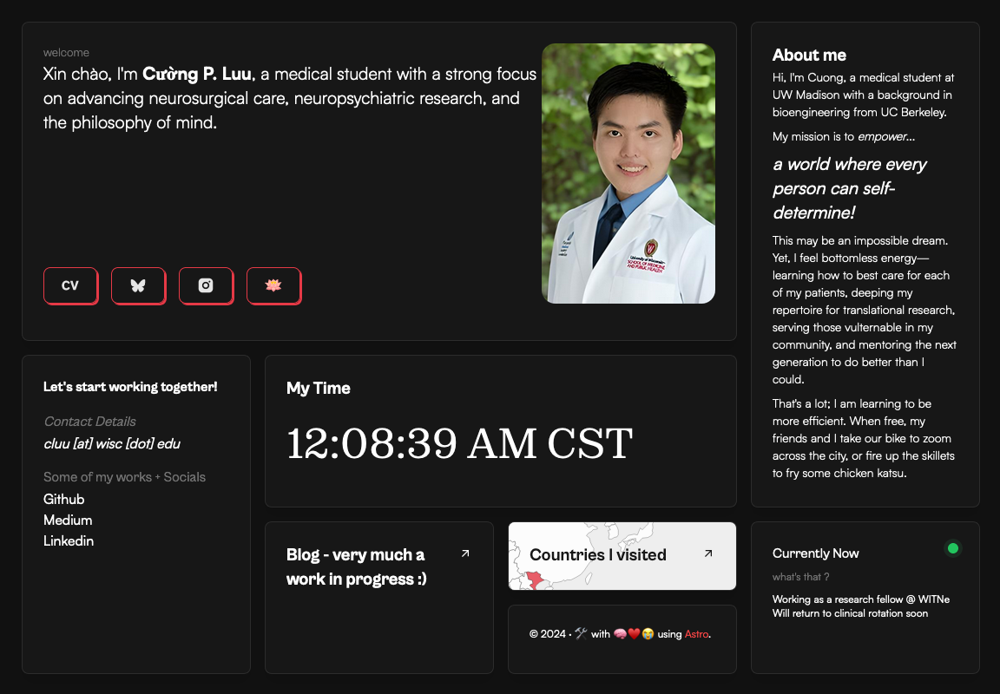

# 🍱 Astro Bento Portfolio

## A personal portfolio website made using the `Astro` framework.



My portfolio example: **[click here](https://cpluu.github.io/)**

## Features

- Modern and Minimal bento-like, sleek UI Design
- All in one page (almost)
- Fully Responsive
- Performances and SEO optimizations
- Ready to be deployed on GitHub Pages
- Blog
- RSS support (your-domain/rss.xml)
- Cool 3d globe

## Tech Stack

- [Astro](https://astro.build)
- [unocss](https://unocss.dev/)
- [motion](https://motion.dev/)
- [d3](https://d3js.org/)

# Steps to building your own 🚀

```bash
# Clone this repository (with American localization by me)
$ git clone https://github.com/CPLuu/cpluu.github.io.git

# or, Clone the original repository (template maintained by the original dev)
$ git clone https://github.com/Ladvace/astro-bento-portfolio
```

```bash
# Go into the repository
$ cd astro-bento-portfolio
```

```bash
# Install dependencies
$ npm install
```

```bash
# Start the project in development
$ npm run dev
```

# Configuration

Remember to replace the `site` and other properties with your data in `astro.config.mjs`

# Deployment  

This website natively supports deployment to GitHub Pages using the included GitHub Actions workflow (`.github/workflows/deploy.yml`).

1. Go to your repository **Settings** -> **Pages**.
2. Under "Source", select **GitHub Actions**.

Your site will automatically build and deploy whenever you push to the `main` branch. For more information, refer to the [official Astro GitHub Pages Guide](https://docs.astro.build/en/guides/deploy/github/).

## Authors ❤️

- Cuong - https://github.com/CPLuu
- Gianmarco (the OG) - https://github.com/Ladvace
