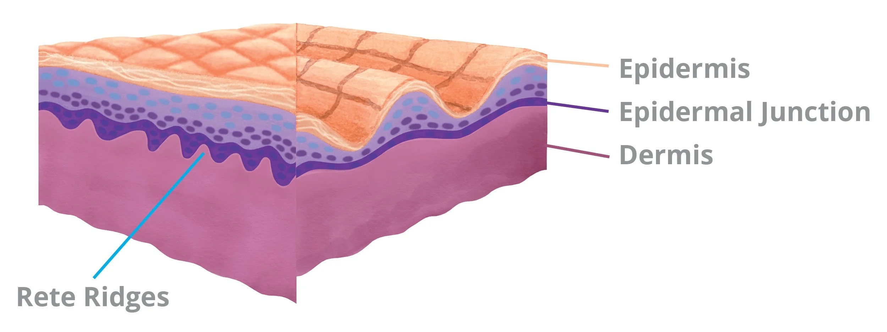

Surgery is a craft, and like many trades, has many ways of accomplishing the same task, eg closing skin without dehiscence. I am sharing a concise list in the order that you are expected to know, replicating the best techniques I saw while rotating through neurosurgery at Wisconsin, Washington, and Brigham. You could have looked all of this up, if you know what you don't know and just have one job of studying (nah, bro, I am drowning 😭).
Start here, but remember that no surgeon has the best technique for everything. If we are fortunate, may we travel and learn the best from across the US, Japan, Turkey, etc. in service of our patients.

# Knot Tying
- Start with 2-hand tying since that's a competency attendings want you to show. Then, everyone just does one hand...
<iframe src="https://docs.google.com/presentation/d/e/2PACX-1vT1McNgappCY64JLY3stghHBd01_vIyVzIlezkhgob7qfv76qE1bzhsdMFn5QkSiWhBkAW1MQApr3ok/pubembed?start=false&loop=false&delayms=60000" frameborder="0" width="480" height="299" allowfullscreen="true" mozallowfullscreen="true" webkitallowfullscreen="true"></iframe>

# Holding your instruments
- Basics: https://www.youtube.com/watch?v=m6T86AevMxw
- Palming the needle drivers (faster rotation): https://www.youtube.com/watch?v=wNjAp5d1p1M
- ! Remember, you are an agent who needs to get things done. Do not be afraid to pick up needles with your hand (just learn to do it safely). Tools have a "correct" way to be held 95% of the time, but sometime, you need to saw a tree branch with a pocketknife to survive.

# Suturing
- Simple interrupted (basics to get your hands used to the driver, won't be used much outside of the ED): https://youtu.be/TFwFMav_cpE?si=bmeDfrbrbuDt88Z1&t=51
- Subcuticular interupted: https://www.youtube.com/watch?v=P32WmJFqhhEr
- Subcuticular running: https://www.youtube.com/watch?v=-rvJZ3jR7AU&t
- https://www.youtube.com/watch?v=jMj6yPmw7zU&t

Subcuticular sutures are some of the harder workhorse sutures surgeons use. It took me some time to get consistent sutures with these because I didn't get an articulated explanation until I was on plastics. The suture runs deep (deep dermis or fat) and comes out superficial, often the "dermal-epidermal" junction. The "dermal-epidermal" junction is the transition from a deep pink/ red (dermis) to lighter pink (light pink; not tan/ dark where the stratum lucideum/ corneum is); this junction may have a ridge. You won't always see the junction! So, it's ok to aim at a consistent superficial level of the dermis. 

It's were the suture is coming out of (the superficial layer) that is the anchor for this suture. So, depending on thickness of the tissue, it's also okay to have a 30-60 deg for your deep to superficial run. Just makes sure that both ends approximate their counterpart on the other side at appropriate depth and length. 

Most suture pad and animal model do not have an accurate representation of this junction. A veterinarian surgeon recommended the *SimSkin Suture Pad* to me; it's more expensive, but give you a great simulation to master this stitch quick outside of the OR.

## Aberdeen knot for closing a running stitch
https://www.youtube.com/watch?v=tRX5cyZMlSA
- Often, we end by driving the needle under the tissue and cut at skin surface to bury the loose end

## Drain stitch
- https://www.youtube.com/watch?v=MzdqBvH45ys

# Self-gowning and gloving
https://www.youtube.com/watch?v=hTBR3yJ5IEs&t=257s
- Additional tips:
  - Only the blue sleeve (not white, porous cuff) is considered sterile, so keep your hand inside the sleeve when picking up gloves for self-donning.
  - Unpack gloves package upside down, so that the respective glove for each hand already have the thumb and cuff orientation needed at pick-up. 

    

      
    

